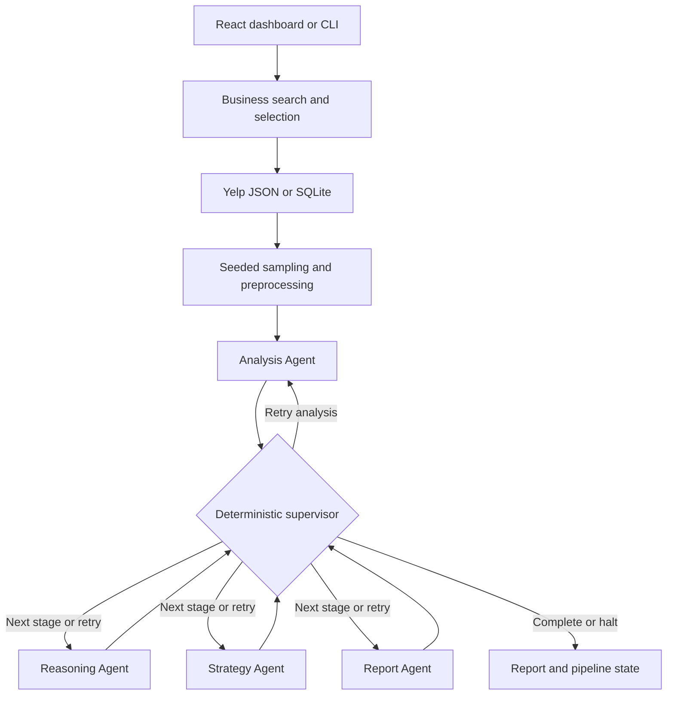

# COS30018 Intelligent Systems

## Multi-Agent Restaurant Review Analysis

A restaurant feedback analysis system built with Python, LangGraph, FastAPI,
and React. It turns a bounded sample of Yelp reviews into sentiment and aspect
labels, recurring problems, root-cause hypotheses, prioritised recommendations,
and a structured report.

Four LLM agents perform the analysis. A deterministic supervisor checks their
outputs after every stage and controls progression, corrective retries, warnings,
and halting. Users can run the pipeline through a command-line interface or a
web dashboard with streamed progress.

## Features

- Search businesses by name and confirm the intended branch using its address
  and business ID.
- Select up to 100 reviews using reproducible sampling, with SQLite lookup or
  raw JSON fallback.
- Classify overall sentiment as positive, negative, neutral, or mixed.
- Extract aspect sentiment for food quality, staff attitude, pricing, wait time,
  ambience, cleanliness, and other feedback.
- Link recurring negative patterns to review IDs and compute their frequencies
  from the analysis output.
- Produce root-cause hypotheses, recommended actions, expected impacts, and
  limitations in a JSON report.
- Display sentiment and aspect summaries in the Dashboard, and stage timings
  in the Pipeline Monitor.
- Evaluate saved outputs with consistency checks, labeled review comparisons,
  and model-based usefulness scoring.

## Architecture



The execution order is **Analysis → Reasoning → Strategy → Report**, with the
same supervisor receiving control after each agent. The CLI and API share the
production nodes and graph through
[`pipeline.py`](backend/app/core/pipeline.py).

| Component | Responsibility |
| --- | --- |
| Analysis Agent | Process review batches, validate one result per input review in the original ID order, and assign sentiment/aspect labels. |
| Reasoning Agent | Identify recurring negative patterns, cite supporting review IDs, and propose causes with confidence labels. |
| Strategy Agent | Turn patterns and causes into prioritised actions. |
| Report Agent | Assemble the upstream findings, causes, recommendations, and limitations into a structured report. |
| Supervisor | Measure output quality and choose `proceed`, `proceed_with_warning`, `retry`, or `halt` using Python rules. |

The production supervisor is implemented in
[`supervision.py`](backend/app/core/supervision.py) and routed by
[`graph.py`](backend/app/core/graph.py). The separate LLM-based
`OrchestratorAgent` remains in the repository but does not make routing decisions
in the production graph.

### Validation and recovery

Agent responses are parsed as JSON and validated against
[Pydantic contracts](backend/app/schemas/contracts.py). The shared agent layer
allows two corrective retries after an invalid response and attempts a configured
fallback model when a primary model call raises an exception.

The supervisor adds stage-level checks:

- **Analysis:** halt below five successful analyses; warn below 30; retry when
  more than half fail or more than 20% of checked sentiments contradict star
  ratings.
- **Reasoning:** verify evidence IDs and aspect presence. Recompute each pattern's
  frequency as the fraction of successful analyses with a negative label for
  that aspect. Differences above 0.05 also produce a warning.
- **Strategy:** check that recommendation issues resemble upstream patterns or
  causes using text similarity.
- **Report:** check upstream cause/recommendation consistency and business name
  and sample size against pipeline state.

Each stage can receive at most two supervisor retries with corrective feedback.
After exhaustion, analysis, reasoning, and report failures halt the pipeline.
Strategy can be marked skipped and allow processing to continue with a warning.
The synchronous report endpoint rejects halted pipelines. Both report endpoints
require a report with `status: "success"` to return a successful result.

## Setup

Use Python 3.11+ and a Node.js version supported by the checked-in Vite lockfile
(`^20.19.0` or `>=22.12.0`). The commands below use PowerShell.

### 1. Install backend dependencies

From the repository root:

```powershell
python -m venv .venv
.\.venv\Scripts\Activate.ps1
python -m pip install fastapi uvicorn pandas rapidfuzz python-dotenv "pydantic>=2" openai langgraph langchain-openai pytest httpx scikit-learn openpyxl
cd backend
```

The repository currently has no Python requirements file or lockfile. This
package list covers application, test, and evaluation imports; backend dependency
versions are not pinned.

### 2. Configure the model provider

For the cloud profile, copy the example and set your provider key in `.env`:

```powershell
Copy-Item .env.example .env
```

The example contains:

```dotenv
OPENAI_API_KEY=your-provider-key
OPENAI_BASE_URL=https://generativelanguage.googleapis.com/v1beta/openai/
OPENAI_MODEL=gemini-2.5-flash
OPENAI_FALLBACK_MODEL=gemini-3.5-flash
YELP_BUSINESS_PATH=backend/data/raw/yelp_academic_dataset_business.json
YELP_REVIEW_PATH=backend/data/raw/yelp_academic_dataset_review.json
MAX_REVIEW_SAMPLE=100
RANDOM_SEED=42
```

These are repository configuration values, not a guarantee of model availability
for every provider account. Set the endpoint and model IDs together. Without
`OPENAI_BASE_URL`, the client uses its default OpenAI endpoint even though the
code's default model names are Gemini names.

For a local Ollama runtime, use the supplied local profile instead:

```powershell
Copy-Item .env.local.example .env
ollama pull llama3.1
```

Keep Ollama running. This profile uses `http://localhost:11434/v1` and `llama3.1`
for both models. The code supplies a placeholder credential for a local endpoint
if no API key is set. The committed evaluation results below do not establish
local-model performance.

Additional settings:

| Variable | Default | Purpose |
| --- | --- | --- |
| `YELP_DB_PATH` | `backend/data/processed/yelp.db` | Optional SQLite index location. |
| `MAX_REVIEW_SAMPLE` | `100` | Maximum selected reviews; must be between 1 and 100. |
| `RANDOM_SEED` | `42` | Seed used for review selection. |
| `ANALYSIS_BATCH_SIZE` | `10` | Reviews per analysis request; use a positive integer. |
| `VITE_API_BASE_URL` | `http://localhost:8000` | Frontend backend URL, set in `frontend/.env` if needed. |

Dataset paths are resolved relative to the repository root unless absolute.
Model settings are resolved centrally in
[`llm_config.py`](backend/app/core/llm_config.py).

### 3. Prepare the Yelp data

Place the Yelp Open Dataset's line-delimited JSON files at:

```text
backend/data/raw/yelp_academic_dataset_business.json
backend/data/raw/yelp_academic_dataset_review.json
```

The raw dataset and generated database are git-ignored. Build the SQLite index
from `backend/` to avoid scanning the full review JSON file on every lookup:

```powershell
python scripts/build_db.py
```

To replace an existing or interrupted index:

```powershell
python scripts/build_db.py --rebuild
```

The loader automatically uses the database when it exists. Otherwise, it reads
the raw files. The builder writes directly to the final database path, so an
interrupted build must be rebuilt before use.

Reviews are sorted by ID before sampling. The same data, seed, and sample size
produce the same selected IDs across the JSON and SQLite paths. Preprocessing
removes missing, blank, and duplicate records, normalises dates, and clips star
ratings to 1–5. The final report size can therefore be smaller than the requested
sample. Seeded sampling does not guarantee identical LLM responses.

### 4. Start the application

With the virtual environment active, start the backend from `backend/`:

```powershell
python -m uvicorn app.main:app --reload
```

In another terminal, start the frontend from the repository root:

```powershell
cd frontend
npm ci
npm run dev
```

Open the URL printed by Vite. Search for a restaurant, select its branch, and
generate a report. The Pipeline Monitor provides a separate view for streamed
stage progress and timing.

### Command-line usage

From `backend/`, run interactively or select a search result explicitly:

```powershell
python run_pipeline.py
python run_pipeline.py --name "LOVE Grille" --pick 1 --sample-size 73 --dump-stages out_demo
```

`--pick` is one-based. Add `--json` to print the report as JSON. `--dump-stages`
writes `analysis.json`, `reasoning.json`, `strategy.json`, `report.json`, and
`_summary.json`. New summaries record provider/model configuration, pipeline
status, retries, errors, skipped stages, and supervision flags. Live runs require
the dataset and a reachable configured model provider.

## API

| Method | Endpoint | Purpose |
| --- | --- | --- |
| GET | `/health` | Process health; returns `{"status":"ok"}`. |
| GET | `/api/businesses/search?name=LOVE%20Grille&top_n=3` | Fuzzy business matches with IDs, addresses, review counts, and scores. |
| POST | `/api/reports` | Run the pipeline and return a structured report. |
| GET | `/api/reports/stream` | Run the pipeline and stream JSON events through SSE. |

Example report request body:

```json
{
  "restaurant_name": "LOVE Grille",
  "business_id": "4Env6uGYxMhXFKPfcuzUuQ",
  "sample_size": 73
}
```

`business_id` and `sample_size` are optional. Without an ID, the API uses the best
fuzzy match. With an ID, it uses the supplied name without cross-checking it
against the business table. `sample_size` must be within `1..MAX_REVIEW_SAMPLE`;
the supervisor still requires at least five successful analyses.

The SSE endpoint accepts the same fields as query parameters and emits
`stage_start`, `stage_end`, `verdict`, `done`, and `error` events. Agent
events include attempt numbers, and stage completion events carry durations.

Successful responses include the report's title, business name, sample size,
executive summary, findings, root causes, recommendations, and limitations, plus
computed `analysis_summary`, `reasoning_summary`, and supervision `flags`.

## Results included in the repository

Two saved runs analyse the same 73 review IDs for **LOVE Grille**, business ID
`4Env6uGYxMhXFKPfcuzUuQ`. Both summaries record completion without skipped stages
or supervisor retries. They are saved examples, not fresh runs of the current
checkout.

| Measure | [`backend/out`](backend/out/report.json) | [`backend/out_hub`](backend/out_hub/report.json) |
| --- | --- | --- |
| Recorded model information | `gemini-2.5-flash` identified by the judge artifact; summary has no `run_config` | Groq: `llama-3.3-70b-versatile`, fallback `llama-3.1-8b-instant` |
| Reviews analysed | 73 | 73 |
| Positive / negative / neutral / mixed | 25 / 32 / 0 / 16 | 31 / 34 / 6 / 2 |
| Patterns / recommendations | 5 / 5 | 4 / 4 |
| Saved Tier 1 checks passed | 24 / 25 | 22 / 22 |
| Sentiment accuracy against the current worksheet | 0.795 (58/73) | 0.945 (69/73) |
| Aspect-presence macro-F1 against the current worksheet | 0.847 | 0.710 |

The analysis scores above were recomputed from each saved `analysis.json` and
the 73 labeled rows in the `Labeling` sheet of
[`tier2_gold_labeling_worksheet.xlsx`](backend/eval/gold/tier2_gold_labeling_worksheet.xlsx).
All 73 IDs align in both runs. The calculation follows
[`tier2_analysis.py`](backend/eval/tier2_analysis.py): sentiment accuracy compares
the overall label, and aspect macro-F1 averages binary aspect-presence F1 across
the seven categories. It does **not** measure correctness of aspect sentiment.
These are offline comparisons of saved predictions, not new model calls.

The [earlier Tier 1 result](backend/out/tier1_report.json) contains one failed
evidence-existence check: a food-quality pattern cites review ID
`SKXs-JiPXpVnAwcXhA5wA`, which is absent from its analysis output. The
[`out_hub` result](backend/out_hub/tier1_report.json) passes all 22 recorded
checks. Check counts differ because the runs produced different numbers of
patterns. Passing consistency checks does not establish that inferred causes
are true.

### Example findings and recommendations

The saved `out_hub` report identifies negative food-quality and pricing feedback
in 30.1% of analysed reviews each, staff-attitude feedback in 20.5%, and wait-time
feedback in 13.7%. Its actions focus on kitchen quality control, menu pricing,
staff training, and service processes. These aspect frequencies can overlap
because a review may mention several issues.

### Saved judge assessment

[`backend/out/tier3_scores.json`](backend/out/tier3_scores.json) records a
`gemini-pro-latest` judge scoring the earlier output on a 1–5 scale:

| Criterion | Score |
| --- | --- |
| Root-cause plausibility, mean | 4.8 |
| Recommendation actionability, mean | 4.2 |
| Report usefulness | 5.0 |

These are subjective model judgments for one restaurant. They do not measure
business outcomes, and no equivalent Tier 3 result is included for `out_hub`.
The dataset is too narrow to establish general performance across restaurants.

## Testing and evaluation

Run offline backend tests from `backend/`:

```powershell
python -m pytest -m "not integration"
```

Tests cover preprocessing, raw/SQLite sampling parity, agent contracts,
supervision and routing, API responses/SSE, provider configuration, and
deterministic evaluation. Live integration tests require model access:

```powershell
python -m pytest -m integration
```

Run frontend API-client tests and a production build from `frontend/`:

```powershell
npm test
npm run build
```

Verification during this README update: **2 frontend tests passed**. Backend
tests could not start because the current Python environment lacks `pytest`.
No live model runs or frontend production build were performed for this update.

### Evaluation commands

From `backend/`:

```powershell
# Tier 1: schemas, evidence, frequencies, traceability, and report consistency.
# Writes tier1_report.json inside the chosen dump directory.
python -m eval.tier1_checks out_hub

# Tier 1b: synthetic degradation and recovery scenarios, without model calls.
python -m eval.harness --skip-live

# Tier 1b: sampling reproducibility, live stage latency, and token usage.
python -m eval.harness --name "LOVE Grille" --pick 1 --runs 3 --seed 42

# Convert the labeled worksheet into the gold JSONL consumed by Tier 2.
python eval/gold/build_gold_jsonl.py eval/gold/tier2_gold_labeling_worksheet.xlsx

# Tier 2: run NEW analysis predictions against the gold labels.
python -m eval.tier2_analysis --gold eval/gold/analysis_gold.jsonl
```

To reproduce the table above from saved predictions after generating the gold
JSONL, use the scoring functions directly; change `out` to `out_hub` for the
second run:

```powershell
python -c "import json; from eval.tier2_analysis import load_gold, score_sentiment, score_aspects_macro_f1; gold = load_gold('eval/gold/analysis_gold.jsonl'); pred = json.load(open('out/analysis.json', encoding='utf-8')); print('sentiment_accuracy:', score_sentiment(gold, pred)); print('aspects:', score_aspects_macro_f1(gold, pred))"
```

Tier 3's entry point is `python -m eval.tier3_judge <dump_dir>`, with the judge
selected by `JUDGE_MODEL`. It uses the configured provider endpoint and key.
However, its three required files under `backend/eval/rubrics/` are absent from
this checkout: `root_cause_plausibility.md`, `recommendation_actionability.md`,
and `report_usefulness.md`. Restore those rubrics before rerunning the judge.

## Repository layout

```text
backend/
  app/
    agents/             Four LLM agents and shared response/retry handling
    core/               Pipeline state, production nodes, graph, and supervision
    data/               Business matching, review loading, and preprocessing
    schemas/            Pydantic input/output contracts
    main.py             FastAPI application and SSE endpoint
  data/raw/             Local Yelp source files (git-ignored)
  data/processed/       Local SQLite index (git-ignored)
  eval/
    fixtures/           Synthetic stage outputs for offline evaluation
    gold/               Labeling worksheet and JSONL conversion utility
    tier1_checks.py     Deterministic checks for saved outputs
    harness.py          Recovery, sampling, latency, and token checks
    tier2_analysis.py   Labeled analysis evaluation
    tier3_judge.py      Model-based usefulness evaluation
  out/                  Earlier saved run and Tier 1/Tier 3 results
  out_hub/              Groq saved run and Tier 1 results
  scripts/build_db.py  SQLite index builder
  tests/                Backend tests
  run_pipeline.py       Interactive and scripted CLI
frontend/
  src/api/              HTTP/SSE client and tests
  src/components/       Business picker
  src/pages/            Dashboard and Pipeline Monitor
  src/App.jsx           View switching
  src/styles.css        Application styles
```

## Current limitations

- Analysis describes the selected, cleaned reviews. It does not represent every
  Yelp review or establish causal explanations for restaurant performance.
- Root causes and expected impacts are generated hypotheses. Numeric improvement
  estimates in the saved reports have not been validated against business data.
- Business matching has no minimum acceptance score or restaurant-category
  filter. A supplied business ID and name are not cross-validated by the API.
- The Dashboard and Pipeline Monitor keep separate state. The monitor displays
  stages by name and does not yet present a separate history for every retry or
  all supervisor events.
- The API has wildcard CORS, no authentication, and no rate limiting. `/health`
  checks process availability only, not datasets, credentials, or model access.
- Python dependency pinning, the missing judge rubrics, and automated CI remain
  gaps in reproducibility.
